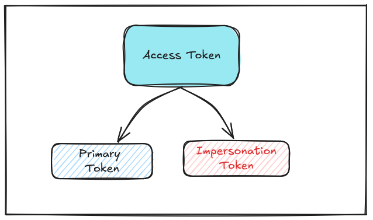
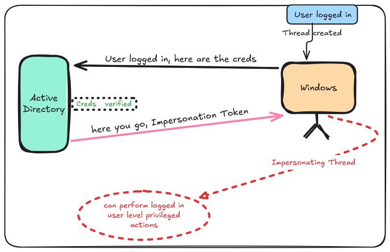
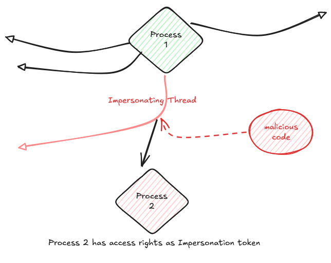

# Token Types

In windows there are potentially two access token types. They are:

- Primary Tokens
- Impersonation Tokens

Each of them can be generalized as an access token.

## Primary Token

- When a user logs in a primary token is given to play around.
- If a process is created by the user, it gets the primary token of the user created it.
- And also a process never gets an Impersonation token.

Let's say, opening the `explorer.exe` a process is created and the primary token is given to that process with the access rights of the user created (or in this case opened) it.

## Impersonation Token

Simply, an Impersonation token is  also an access token which is given to the threads of a process (but not to the process itself) to perform actions impersonating the user under whom the thread is created.

(How a thread can be created by the other user when the process itself is running under a different user?)

### Let's under this scenario

Suppose a web service application is running on a computer  C1 , under a service account web_svc. And it has a functionality to access the file on the file server.

- The web service application which is running on C1 creates a process with the access rights as the account web_svc.

We have a user named ITboy , a member of IT  group who has access to the IT folder on the file server, and the web_svc is neither in the IT group, nor has the permissions to access the IT folder.

- It's clear that the web_svc cannot access the IT folder and also the process which has the primary token of the web_svc.

- When the ITboy logs into the web service new thread is created and windows verifies the credentials of the ITboy against the Active Direcotory.

- Windows then attaches that token to the specific Thread handling ITboy's web request.

# How an Attacker can exploit this?

Considering OPSEC , an attacker actually injects their malicious code into the **Process** . Then, they **hijack the existing Thread** that is currently having the high-privilege Impersonation Token and force it to execute the injected code

Which then creates new process  with the impersonation token as the primary token for the new process created.

